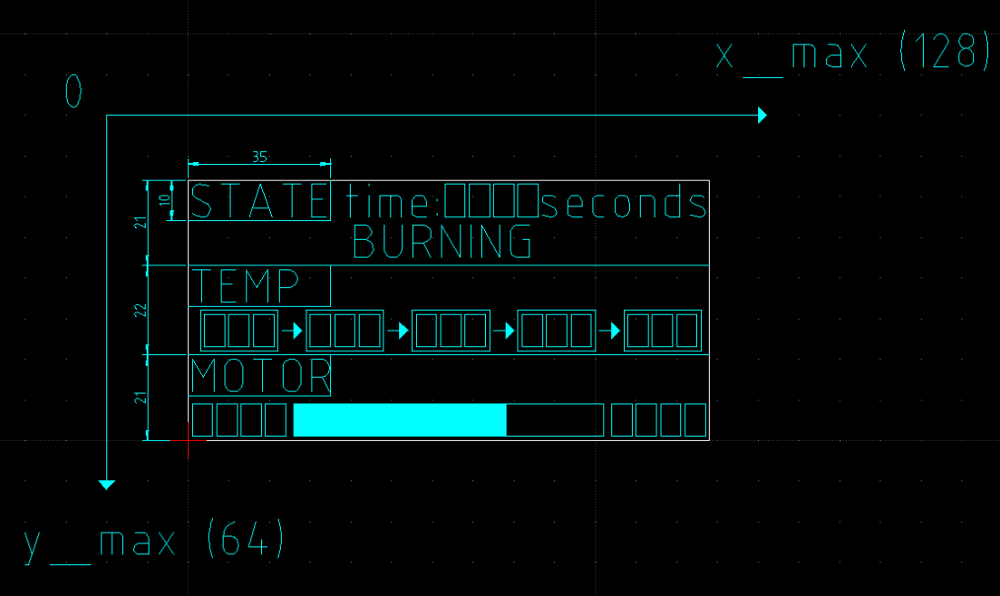

# heizkostenminimalisator
Software to control the inlet air of a stove with temperature sensor and (in a later version communication over MQTT)

Programmed in VSCode with PlatformIO.

## Basic Procedure
* The temperature is measured every TEMP_CHECK_PERIOD, triggered by an interrupt (and also wake-up routine)

* The oven door-switch has to be connected to an RTC GPIO-PIN https://docs.espressif.com/projects/esp-idf/en/latest/esp32/api-reference/peripherals/gpio.html (defined in pin_setup.h)

  * When the door is **open, the pin measures inf. resistance => pin is internally pulled up. Therefore, the interrupt is triggered when input-pin is 1 -> check this in `ẁakeup_routines.cpp` line 17**

* As for now, the state, temperature etc. will be displayed on a external display https://eckstein-shop.de/WaveShare-096inch-OLED-Display-Module-White-on-Black-128x64-SPI-I2C.

* The setup of the display is defined in `display.h` (see `display_setup.dxf`)

* 

* **Possible extension: Check for 5 Minutes on a HTML-Server to check whether someone wants to change some parameters**

* **Possible extension: Communicate over MQTT if activated**

  

## STATE CHART

## CONSTANTS
- defined in various files (`pin_setup.h,` `main.cpp`, `motor_control.h`, `wakeup_routines.h`, `thermocouple.h`)
- **The ones marked with /// TODO: .... have to be changed by the user**

## COOL_DOWN

The motor opening gets set according to slope between the highest measured temperature and the cool down temperature and the two motor-openings:

Motor_opening = current temperature
$$
M_{current} = T_{current} * slope + offset
$$

## Project Components
### [Thermocouple Digital Converter](https://cdn-shop.adafruit.com/datasheets/MAX31855.pdf)
SPI-output as 14 bit signed (integer)
### [Selfmade Voltage Stepper](https://www.falstad.com/circuit/circuitjs.html?ctz=CQAgjCAMB0l3BWEBmAHAJmgdgGzoRmACzICcpkORIC6NNkNApgLRhgBQA5iKnCOlSpe-ZMhxQoHAMYgcQ8DkZ9GYJZJjxIydOT36DE9tGRYEWUlVJYwqBGDqbInAE4jV6lQIWqtHIpCkNKR0aozywmHgUNASbGDQpAhEWJCoYKR8GYLIAsjQEJDccgHgISWM6OjUjEUAShXggo3sjpKlDhoxCMURKHRmdDoaHADuwXSWE+BENWPTU31TRW5LEn3DjAhKK3IKUWuSVfAcDYMgU17L7VtdMD08fYLCG+IjqwpT59dgfh+R6iePnAfgaCHKYFwNE6kIktRApSQ8PuHAA9jMSjdyAJarBnNt8EcMcgOEA)

Is driven by PIN_MOTOR_OUT (analog) between the voltages pwm_closed to pwm_open and gives following voltage to PWM-duty-cycle ratio (on the x-axis)

## FLASH image to ESP32:
Ubuntu:
	1. check where the ESP32 is connecting to in /dev/tty**** . Normally (/dev/ttyUSB0) or /dev/ttyACM0
	2. add your current user to dialout - group (sudo adduser <username> dialout)
	3. change the owner of /dev/tty** to the current user: sudo chown username /dev/ttyUSB0
	Windows:
	1. Check the port in device-manager

Both:
	Check the right port (COM6 or /dev/ttyUSB0) is taken in plaformio.io - file :)

## old DAC25_ino
/*
 * Copyright (c) 2018, circuits4you.com
 * All rights reserved.
 * 
 * ESP32 DAC - Digital To Analog Conversion Example
 */
#ifdef INCLUDE
#include <SPI.h>
#include <Wire.h>
#include <Adafruit_GFX.h>
#include <Adafruit_SH110X.h>
/* Uncomment the initialize the I2C address , uncomment only one, If you get a totally blank screen try the other*/
#define i2c_Address 0x3c //initialize with the I2C addr 0x3C Typically eBay OLED's

#define SCREEN_WIDTH 128 // OLED display width, in pixels
#define SCREEN_HEIGHT 64 // OLED display height, in pixels
#define OLED_RESET -1   //   QT-PY / XIAO
Adafruit_SH1106G display = Adafruit_SH1106G(SCREEN_WIDTH, SCREEN_HEIGHT, &Wire, OLED_RESET);

#define DAC1 25
char Carray[100];
char x;
int i = 0;

//Test

void setup() {
  Serial.begin(9600);
  delay(250); // wait for the OLED to power up
  display.begin(i2c_Address, true); // Address 0x3C default
  display.setContrast (0); // dim display
  display.display();
  delay(1000);
  display.setTextSize(2);
  display.setTextColor(SH110X_WHITE);
}

void loop(){
  for (i=0;i<=99;i++) {Carray[i] = char(0);}
  i=0;
  while ((Serial.available() > 0) & (i < 3)) {
    x=Serial.read();
    switch (x) {
     case '0' ... '9':  {Carray[i]=x;i++;Serial.print(x);Serial.print("|");Serial.print(i);Serial.print("|");}
    }
  }
  if (Carray[0] != char(0)) {
    Serial.println();
    Serial.println(Carray);
    unsigned int dutyCycle = (atoi(Carray));
    Serial.println(dutyCycle);

    display.clearDisplay();
    display.setCursor(0, 0);
    display.print("Vout:");
    display.println(dutyCycle);
    display.print("Soll:");
    display.print(int((dutyCycle-120)*100/120));
    display.println(" %");
    display.print("V in:");
    display.println("0 V");
    display.print("Ist: ");
    display.println("0 %");
    display.display();
    
    dacWrite(DAC1, dutyCycle);
    delay(2000);
  }
  delay(100);
}

#endif